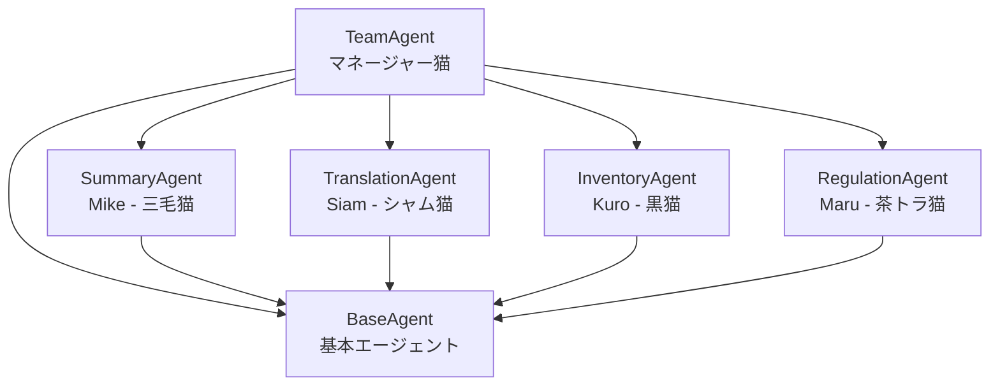
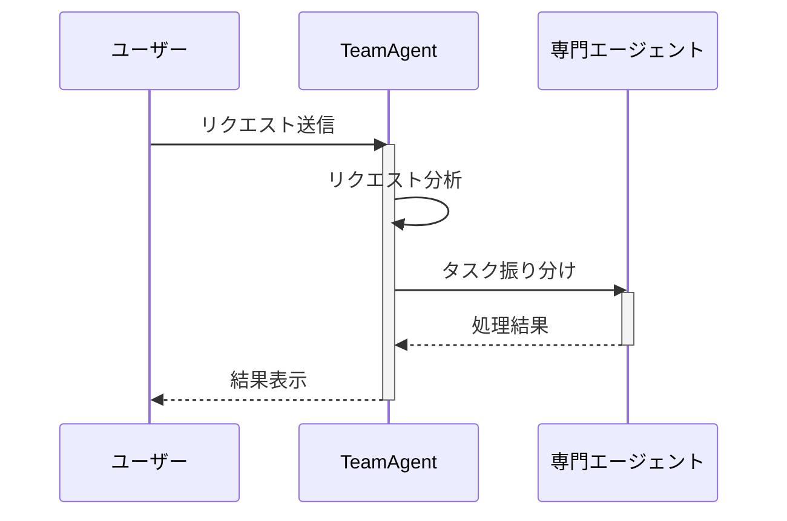

# 🐱 Nyagora - AIエージェントシステム

<div align="center">

[](https://www.python.org/)
[](https://streamlit.io/)
[](https://openai.com/)
[](LICENSE)

</div>

## 🌟 プロジェクト概要

Nyagoraは、賢い猫たちがあなたのタスクをサポートする特別なAIエージェントシステムです。Streamlitを利用した直感的なインターフェースと、個性豊かな猫エージェントたちが、あなたの要望に優しく寄り添いながら、効率的な解決策を提供します。

## 🐱 エージェント構成



### エージェント役割詳細

| エージェント名 | 役割 | 特徴 |
|--------------|------|------|
| Mike（三毛猫） | 要約スペシャリスト | - 細かい観察力を活かした正確な要約<br>- のんびりと丁寧な仕事が得意 |
| Siam（シャム猫） | フランス語翻訳エキスパート | - 気品のある洗練された翻訳<br>- フランス文化への深い造詣 |
| Kuro（黒猫） | 在庫管理エキスパート | - 几帳面な性格で正確な管理<br>- 入出荷・在庫レベルの監視が得意 |
| Maru（茶トラ猫） | 規定管理スペシャリスト | - 社内規定や法令に精通<br>- コンプライアンス観点からの助言 |

## 🔄 処理フロー



## 📂 プロジェクト構成

```
nyagora/
├── src/
│   ├── agents/          # エージェント関連のモジュール
│   │   ├── __init__.py
│   │   ├── base_agent.py
│   │   ├── team_agent.py
│   │   └── ...
│   ├── utils/           # ユーティリティ関数
│   │   ├── __init__.py
│   │   └── stream_helpers.py
│   └── app.py          # メインアプリケーション
├── .env                # 環境変数設定
└── requirements.txt    # 依存パッケージ
```

## 🛠️ 技術スタック

- **フレームワーク**: Streamlit
- **AI基盤**: OpenAI GPT-4
- **依存パッケージ**:
  - streamlit
  - openai
  - agno
  - python-dotenv

## 🚀 セットアップ手順

1. リポジトリのクローン：
```bash
git clone https://github.com/Sunwood-ai-labs/agno-sample-company-Nyagora.git
cd agno-sample-company-Nyagora
```

2. 仮想環境の作成と有効化：
```bash
python -m venv venv
source venv/bin/activate  # Linuxの場合
# または
.\venv\Scripts\activate  # Windowsの場合
```

3. 依存パッケージのインストール：
```bash
pip install -r requirements.txt
```

4. 環境変数の設定：
   - `.env.example` をコピーして `.env` を作成
   - OpenAI APIキーを設定

5. アプリケーションの起動：
```bash
streamlit run src/app.py
```

## 💫 使用方法

1. ブラウザで表示されたURLにアクセス（通常は http://localhost:8501）
2. テキストエリアにリクエストを入力
3. 「送信」ボタンをクリックして処理を開始
4. リアルタイムで進捗状況を確認
5. 結果の確認（処理時間なども表示）

## 🔧 開発ガイドライン

### 命名規則
- **変数名・関数名・クラス名**: 英語で記述
- **コメント・ドキュメント**: 日本語で記述

### コーディング規約
- PEP 8に準拠したPythonコーディングスタイル
- 関数とクラスには適切なドキュメンテーション文字列を付与
- 意味のある変数名とコメントの使用

## 📜 ライセンス

本プロジェクトはMITライセンスの下で公開されています。詳細は[LICENSE](LICENSE)ファイルをご参照ください。

## 👥 コントリビューション

プロジェクトへの貢献を歓迎します。以下の手順で参加できます：

1. このリポジトリをフォーク
2. 新しいブランチを作成（`git checkout -b feature/awesome-feature`）
3. 変更をコミット（`git commit -m '新機能を追加'`）
4. ブランチをプッシュ（`git push origin feature/awesome-feature`）
5. プルリクエストを作成

## 📞 サポート

ご質問やフィードバックがございましたら、Issueを作成してください。
